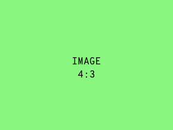

# Cards

## Regular Cards

Card with headline.

<div class="olt-card olt-card--header__bottom">
    <div class="olt-card-header">
        <div class="olt-card-header__title-wrapper">
            <span class="olt-card-header__headline">
                Headline M - Title
            </span>
        </div>
        <div class="olt-card-header__action-wrapper">
            <i class="material-icons">more_vert</i>
        </div>
    </div>
</div>

```html
<div class="olt-card olt-card--header__bottom">
    <div class="olt-card-header">
        <div class="olt-card-header__title-wrapper">
            <span class="olt-card-header__headline">
                Headline M - Title
            </span>
        </div>
        <div class="olt-card-header__action-wrapper">
            <i class="material-icons">more_vert</i>
        </div>
    </div>
</div>
```

Card with headline and subtitle.

<div class="olt-card">
    <div class="olt-card-header">
        <div class="olt-card-header__title-wrapper">
            <span class="olt-card-header__headline">
                Headline S - Title
            </span>
            <span class="olt-card-header__subtitle">
                Copy S - Subtitle
            </span>
        </div>
        <div class="olt-card-header__action-wrapper">
            <i class="material-icons">more_vert</i>
        </div>
    </div>
</div>

```html
<div class="olt-card">
    <div class="olt-card-header">
        <div class="olt-card-header__title-wrapper">
            <span class="olt-card-header__headline">
                Headline S - Title
            </span>
            <span class="olt-card-header__subtitle">
                Copy S - Subtitle
            </span>
        </div>
        <div class="olt-card-header__action-wrapper">
            <i class="material-icons">more_vert</i>
        </div>
    </div>
</div>
```

Card with headline and content.

<div class="olt-card olt-card--primary-01">
    <div class="olt-card-header">
        <div class="olt-card-header__title-wrapper">
            <span class="olt-card-header__headline">
                Headline M - Title
            </span>
        </div>
        <div class="olt-card-header__action-wrapper">
            <i class="material-icons">more_vert</i>
        </div>
    </div>
    <div class="olt-card-content">
        This is the card content.
    </div>
</div>

```html
<div class="olt-card olt-card--primary-01">
    <div class="olt-card-header">
        <div class="olt-card-header__title-wrapper">
            <span class="olt-card-header__headline">
                Headline M - Title
            </span>
        </div>
        <div class="olt-card-header__action-wrapper">
            <i class="material-icons">more_vert</i>
        </div>
    </div>
    <div class="olt-card-content">
        This is the card content.
    </div>
</div>
```

Simple card just with content.

<div class="olt-card">
    <div class="olt-card-content">
        Lorem ipsum dolor sit amet, consetetur sadipscing elitr, 
        sed diam nonumy eirmod tempor invidunt ut labore et 
        dolore magna aliquyam erat, sed diam voluptua. 
        At vero eos et accusam et justo duo dolores et ea rebum. 
        Stet clita kasd gubergren, no sea takimata sanctus est 
        Lorem ipsum dolor sit amet.
    </div>
</div>

```html
<div class="olt-card">
    <div class="olt-card-content">
        Lorem ipsum dolor sit amet, consetetur sadipscing elitr, 
        sed diam nonumy eirmod tempor invidunt ut labore et 
        dolore magna aliquyam erat, sed diam voluptua. 
        At vero eos et accusam et justo duo dolores et ea rebum. 
        Stet clita kasd gubergren, no sea takimata sanctus est 
        Lorem ipsum dolor sit amet.
    </div>
</div>
```

Simple card just with content and no padding.

<div class="olt-card olt-card--no-padding">
    <div class="olt-card-content">
        Lorem ipsum dolor sit amet, consetetur sadipscing elitr, 
        sed diam nonumy eirmod tempor invidunt ut labore et 
        dolore magna aliquyam erat, sed diam voluptua. 
        At vero eos et accusam et justo duo dolores et ea rebum. 
        Stet clita kasd gubergren, no sea takimata sanctus est 
        Lorem ipsum dolor sit amet.
    </div>
</div>

```html
<div class="olt-card olt-card--no-padding">
    <div class="olt-card-content">
        Lorem ipsum dolor sit amet, consetetur sadipscing elitr, 
        sed diam nonumy eirmod tempor invidunt ut labore et 
        dolore magna aliquyam erat, sed diam voluptua. 
        At vero eos et accusam et justo duo dolores et ea rebum. 
        Stet clita kasd gubergren, no sea takimata sanctus est 
        Lorem ipsum dolor sit amet.
    </div>
</div>
```

## Teaser Cards

Teaser Card Small

<div class="olt-card olt-card--teaser-small">
    <div class="olt-card-header">
        <div class="olt-card-header__title-wrapper">
            <span class="olt-card-header__headline">
                Headline M - Title
            </span>
        </div>
        <div class="olt-card-header__action-wrapper">
            <i class="material-icons">chevron_right</i>
        </div>
    </div>
</div>

```html
<div class="olt-card olt-card--teaser-small">
    <div class="olt-card-header">
        <div class="olt-card-header__title-wrapper">
            <span class="olt-card-header__headline">
                Headline M - Title
            </span>
        </div>
        <div class="olt-card-header__action-wrapper">
            <i class="material-icons">chevron_right</i>
        </div>
    </div>
</div>
```

Teaser Card Large

<div class="olt-card olt-card--teaser-large">
    <div class="olt-card-header">
        <div class="olt-card-header__title-wrapper">
            <span class="olt-card-header__headline">
                Headline M - Title
            </span>
        </div>
        <div class="olt-card-header__action-wrapper">
            <i class="material-icons">chevron_right</i>
        </div>
    </div>
</div>

```html
<div class="olt-card olt-card--teaser-large">
    <div class="olt-card-header">
        <div class="olt-card-header__title-wrapper">
            <span class="olt-card-header__headline">
                Headline M - Title
            </span>
        </div>
        <div class="olt-card-header__action-wrapper">
            <i class="material-icons">chevron_right</i>
        </div>
    </div>
</div>
```


## Image Teaser

<div class="olt-card olt-card--teaser-stage">
    <div class="olt-card__stage">
      
    </div>
    <div class="olt-card-header">
        <div class="olt-card-header__title-wrapper">
            <span class="olt-card-header__headline">
                Headline M - Title
            </span>
        </div>
        <div class="olt-card-header__action-wrapper">
            <i class="material-icons">chevron_right</i>
        </div>
    </div>
</div>

```html
<div class="olt-card olt-card--teaser-stage">
    <div class="olt-card__stage">
      
    </div>
    <div class="olt-card-header">
        <div class="olt-card-header__title-wrapper">
            <span class="olt-card-header__headline">
                Headline M - Title
            </span>
        </div>
        <div class="olt-card-header__action-wrapper">
            <i class="material-icons">chevron_right</i>
        </div>
    </div>
</div>
```
